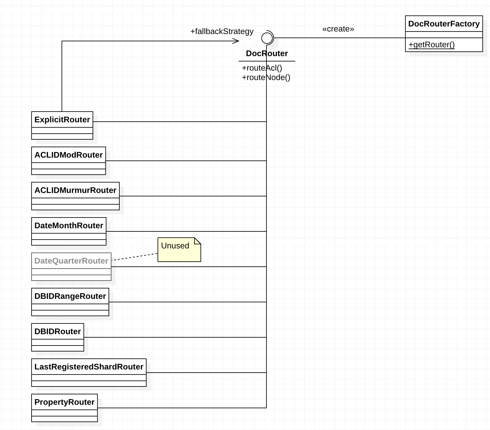
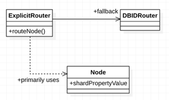
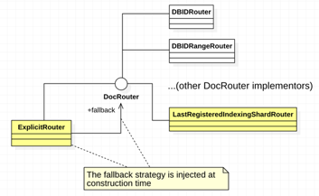
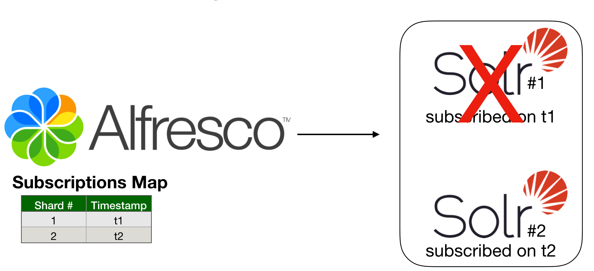
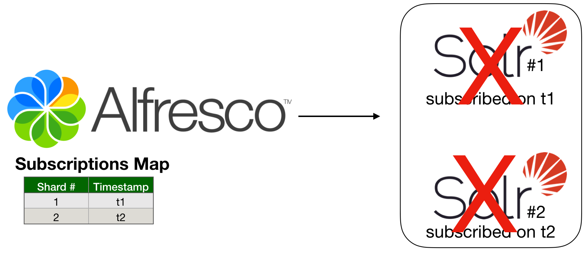
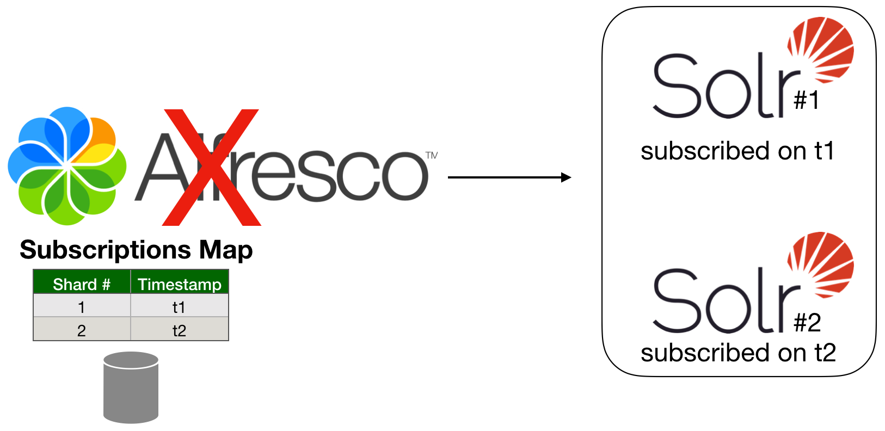

## DocRouters


### Introduction
When an index grows too large to be stored on a single search server, it can be distributed across multiple search servers. This is known as _sharding_. The distributed/sharded index can then be searched using Alfresco/Solr's distributed search capabilities.
Search Services can use any of these four different methods for routing documents and ACLs to shards.

The following diagram illustrates the DocRouter class hierarchy; the DocRouter interface, which declares the main contract, and all concrete implementors.



The light gray color on the _DateQuarterRouter_ is because it is not currently used.

### How a DocRouter is choosen 
To use a specific sharding method, when creating a shard we must add the required configuration properties in the solrcore.properties.
There's a first required property (called _"shard_method"_) which is the mnemonic code associated to the sharding method, then additional properties could be needed, depending on the method.  

As you can see from the class diagram above, the _DocRouter_ instance creation is a responsibility of the _DocRouterFactory_. 
Since we are interested (see the _DocRouter_ interface) in distributing ACLs and Nodes, the _MetadataTracker_ and the _ACLTracker_ read the shard_method in the configuration and create/use the corresponding _DocRouter_ instance. 
If the sharding method doesn't correspond to a valid option (e.g. invalid or unknown mnemonic code) then the system will fallback to _DBID_ routing (_DBDIDRouter_).

### Available document routers

The following table lists the available sharding methods and the associated mnemonic codes (i.e. the value of the "shard_method" attribute we need to configure in solrcore.properties).

| Name | Code     | 
| -----|---------|
|ACL (MOD) |MOD_ACL_ID|
|ACL (HASH) |ACL_ID|
|DBID (HASH)|DB_ID|
|DBID (RANGE)|DB_ID_RANGE|
|Month|DATE|
|Metadata|PROPERTY|
|Last registered indexing Shard|LRIS or LAST_REGISTERED_INDEXING_SHARD|
|Explicit Shard ID (fallback on DBID)|EXPLICIT_ID or EXPLICIT_ID_FALLBACK_DBID|
|Explicit Shard ID (fallback on LRIS)|EXPLICIT_ID_FALLBACK_LRIS|

##### ACL (MOD_ACL_ID)
Nodes and access control lists are grouped by their ACL identifier. This places the nodes together with all the access control information required to determine the access to a node in the same shard. Both the nodes and access control information are sharded. 
The overall index size will be smaller than other methods as the ACL index information is not duplicated in every shard. Also, the ACL count is usually much smaller than the node count.
This method is beneficial if you have lots of ACLs and the documents are evenly distributed over those ACLs. 
> The node distribution may be uneven as it depends how many nodes share ACLs. 

In order to use this method, the following properties are required:

```
shard.method=MOD_ACL_ID
shard.instance=<shard.instance>
shard.count=<shard.count>
```

where 

* shard.method is the mnemonic code associated with this router
* shard.instance is the shard identifier, which must be unique across the cluster
* shard.count is the total number of the shards composing the cluster

##### ACL (ACL_ID)
The sharding method is similar to the previous one, except that the murmur hash of the ACL ID is used in preference to its modulus. 
This gives better distribution of ACLs over shards. The distribution of documents over ACLs is not affected and can still be skewed.

Apart the different mnemonic code, this option has the same configuration attributes of the MOD_ACL_ID.

##### DBID (DB_ID)
This is the default sharding method used in Solr 6. As mentioned above, this is also the method used in case an invalid or unknown value is detected in the shard.method property.
Nodes are evenly distributed over the shards at random based on the murmur hash of the DBID. The access control information is duplicated in each shard. The distribution of nodes over each shard is very even and shards grow at the same rate.

In order to use this method, the following properties are required:

```
shard.method=DB_ID
shard.instance=<shard.instance>
shard.count=<shard.count>
```

where 

* shard.method is the mnemonic code associated with this router
* shard.instance is the shard identifier, which must be unique across the cluster
* shard.count is the total number of the shards composing the cluster


##### DBID Range (DB_ID_RANGE)
This sharding method routes documents within specific DBID ranges to specific shards. It adds new shards to the cluster without requiring a reindex. As consequence of that, the total number of shards (i.e. the shard.count attribute) mustn't be known in advance. 
For each shard, you specify the range of DBIDs to be included. As your repository grows you can add shards.

In order to use this method, the following properties are required:

```
shard.method=DB_ID_RANGE
shard.instance=<shard.instance>
shard.range=0-200000
```

where 

* shard.method is the mnemonic code associated with this router
* shard.instance is the shard identifier, which must be unique across the cluster
* shard.range is the range of DBID that must belong to the shard


##### Month (DATE)
This method assigns dates sequentially through shards based on the month.
For example: If there are 12 shards, each month would be assigned sequentially to each shard, wrapping round and starting again for each year. 
The non-random assignment facilitates easier shard management - dropping shards or scaling out replication for some date range. Typical ageing strategies could be based on the created date or destruction date.
Each shard contains copies of all the ACL information, so this information is replicated in each shard. However, if the property is not present on a node, sharding falls back to the DBID murmur hash to randomly distribute these nodes.

In order to use this method, the following properties are required:

```
shard.method=DATE
shard.key=cm:created
shard.instance=<shard.instance>
shard.count=<shard.count>
(optional)shard.date.grouping=4
```

where 

* shard.method is the mnemonic code associated with this router
* shard.key is the node property which contains the date used by this sharding method
* shard.instance is the shard identifier, which must be unique across the cluster
* shard.range is the range of DBID that must belong to the shard
* shard.date.grouping is an optional property used for grouping months together
* shard.count is the total number of the shards composing the cluster

##### Metadata (PROPERTY)
This method hashes the value of a node property and it uses the hash for targeting a given shard. All nodes with the same property value will be assigned to the same shard. Each shard will duplicate all the ACL information.
Only properties of type d:text, d:date and d:datetime can be used. For example, the recipient of an email, the creator of a node, some custom field set by a rule, or by the domain of an email recipient. The keys are randomly distributed over the shards using murmur hash.

In order to use this method, the following properties are required:

```
shard.method=PROPERTY
shard.key=cm:creator
shard.instance=<shard.instance>
shard.count=<shard.count>
(optional)shard.regex=^\d{4}
```

where 

* shard.method is the mnemonic code associated with this router
* shard.key is the node property whose value will be used for determining the target shard
* shard.instance is the shard identifier, which must be unique across the cluster
* shard.count is the total number of the shards composing the cluster
* shard.regex is an optional property which applies a regex on the node property value, before hashing it. 


##### Last Registered Indexing Shard (LRIS)

> WARNING: This is an experimental feature that is subject to change.
The current known issues are:
> 
> \- Incompatibility with the "Purge" action on the Alfresco Admin Console   
> \- Incompatibility with the "Purge on Startup" option on the Alfresco Admin Console
>    
> As a result, when this router is used and the purge action is invoked you may experience a wrong shard subscription   
> registration order. That would cause a wrong distribution of the indexed data across the cluster.   
>   
> Note the "Purge on restart" option on the Admin Console is checked by default, so before building a   
> Solr cluster which uses this router, please make sure the check has been disabled.  

This method uses, as the name suggests, the last indexing shard which subscribed to the Shard Registry. 
Like the _DB_ID_RANGE_ strategy, it's possible to add new shards to the cluster without requiring a reindex. And as consequence of that, the total number of shards (i.e. the _shard.count_ attribute) isn't needed with this sharding strategy. 
At indexing time, when the _MetadataTracker_ periodically asks for transactions and nodes, Alfresco repository creates the nodes instances and, using the associated transaction timestamp, asks to the _ShardRegistry_ which is the target Shard which should index/own the node.
This _DocRouter_ will then use that information in order to understand if the incoming node belongs to it or not.

In order to use this method, the following properties are required:

```
shard.method=LRIS
shard.instance=<shard.instance>
```

where 

* shard.method is the mnemonic code associated with this router
* shard.instance is the shard identifier, which must be unique across the cluster

###### ShardRegistry and ShardSubscription
On SearchServices side, the _MetadataTracker_ periodically communicates the hosting Shard state to Alfresco repository. 
Alfresco, on its side, maintains a registry which provides near-real-time information about the Solr cluster (e.g. shards, shards state, topology). The very first time a shard subscribes the ShardRegistry creates a subscription for it.
A ShardSubscription is a simple entity which includes 

* the shard id 
* the subscription timestamp
* the owning core name (i.e. the name of the core the shards belongs to)

Shard subscriptions are 

* collected and sorted by subscription timestamp descendent order (i.e. the first entry is the last subscriber)
* persisted on the database

The persistence is needed because in case of restart Alfresco needs to restore the subscriptions map and the correct shard topology. If no persistence definition exists, the map is empty and the registry will wait for the first subscriber.

##### Explicit Shard ID with fallback on DBID (EXPLICIT_ID, EXPLICIT_ID_FALLBACK_DBID)
Nodes are routed to shards accordingly to a value of a node property which is supposed to contain the target shard instance identifier. 
Note that this is different from the "PROPERTY" doc router seen above because no hashing occurs on the node property: 

* it must be numeric (it can be also a string with a numeric content)
* it must contain the target shard instance identifier

If the system is not able to determine a numeric id from the configured node property, then the doc router uses the DB_ID as a fallback strategy.
Although the primary sharding method (the numeric node property) results in an "elastic sharding" approach (we don't need to know the total number of shards in advance), when this doc router is 
used, we still need to know the _shard.count_ attribute, because it is a required parameter for the fallback router (DB_ID)



In order to use this method, the following properties are required:

```
shard.method=EXPLICIT_ID_FALLBACK_DBID
shard.key=cm:targetShardInstance
shard.instance=<shard.instance>
shard.count=<shard.count>
```

where 

* shard.method is the mnemonic code associated with this router. Note that also _EXPLICIT_ID_ can be used
* shard.key is the node property whose value will be used for determining the target shard
* shard.instance is the shard identifier, which must be unique across the cluster
* shard.count is the total number of the shards composing the cluster (required by the DBID fallback strategy)

##### Explicit Shard ID with fallback on LRIS (EXPLICIT_ID_FALLBACK_LRIS)

> WARNING: This is an experimental feature that is subject to change.
The current known issues are:
> 
> \- Incompatibility with the "Purge" action on the Alfresco Admin Console   
> \- Incompatibility with the "Purge on Startup" option on the Alfresco Admin Console
>    
> As a result, when this router is used and the purge action is invoked you may experience a wrong shard subscription   
> registration order. That would cause a wrong distribution of the indexed data across the cluster.   
>   
> Note that if "Purge on restart" option on the Admin Console is checked by default, then before building a   
> Solr cluster which uses this router, please make sure the check has been disabled.  

This method still belongs to the "explicit" id family, where nodes are routed to shards accordingly to a value of a node property which is supposed to contain the target shard instance identifier. 
So it is very similar to the previous one. The important difference resides in the fallback strategy: in case the target shard cannot be determined used the supplied node property, the 
"Last Registered Indexing Shard" is used as fallback. 
Since both strategies (the primary and the fallback) are "elastic", this sharding method doesn't have to know the total number of shards: new shards can be added without any reindexing.



Let's see what happens when a member in the cluster (a Solr or Alfresco node) is restarted.
In all the examples below we have: 

* an Alfresco instance, which maintains the persisted subscriptions map
* two shards (i.e. Solr nodes): S1 subscribed at t1, S2 subscribed at t2   

**Example #1: One shard is restarted**  



In order to better explain the system behaviour we'll enumerate two sub-scenarios:

* **Indexed data is not lost**: after restarting, the node will find itself already registered in the subscription map. If it is the last indexing registered shard Alfresco will continue to  use it as target indexing shard for the new incoming data    
* **Indexed data is lost**: after restarting, the node will still find its subscription in the ShardRegistry. That means on Alfresco side, the Shard is still associated with the proper transaction range. It will request data (e.g. txn, nodes) from Alfresco and the doc router will accept only those nodes that belong to a transaction within that range.

**Example #2: Two shards are restarted**  



Shard subscriptions are persisted on Alfresco side, so this scenario is similar to the previous one: regardless the shards have the indexed data or not after a restart, their corresponding subscription are still available on the ShardRegistry. That means the doc router will be aware about the range of transactions that must be (re)indexed in the two nodes. 

**Example #3: Alfresco is restarted**  



The Shard Subscriptions Map is persisted on the database. That means its whole definition can survive to a system crash. 
After restarting, subscriptions are restored from the database so each shard will be aware about the range of transactions it belongs to.

In order to use this method, the following properties are required:

```
shard.method=EXPLICIT_ID_FALLBACK_DBID
shard.key=cm:targetShardInstance
shard.instance=<shard.instance>
```

where 

* shard.method is the mnemonic code associated with this router. Note that also _EXPLICIT_ID_ can be used
* shard.key is the node property whose value will be used for determining the target shard
* shard.instance is the shard identifier, which must be unique across the cluster